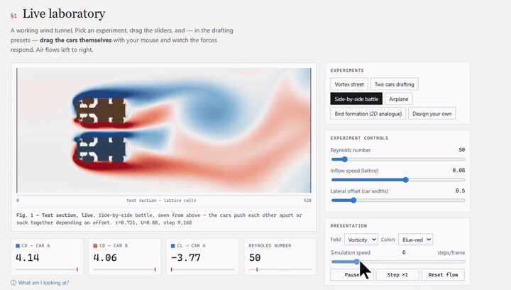
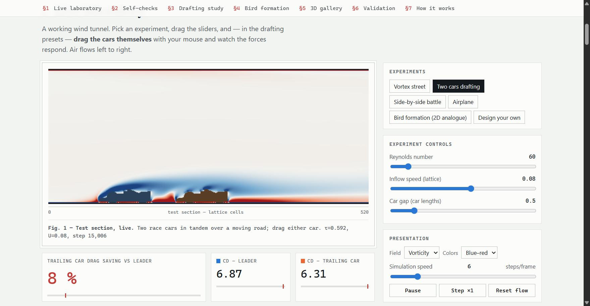
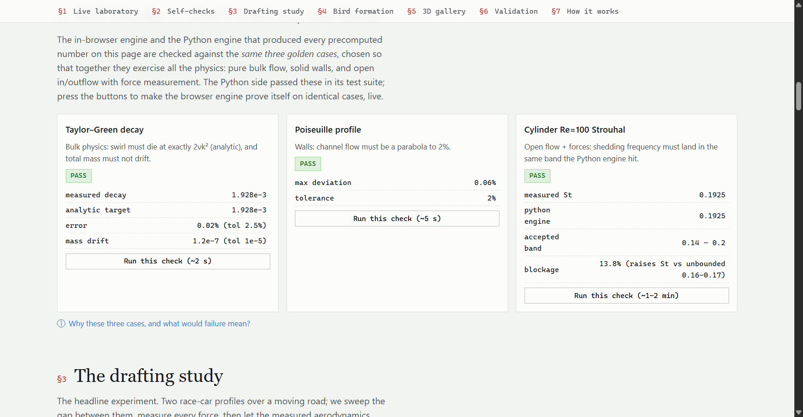
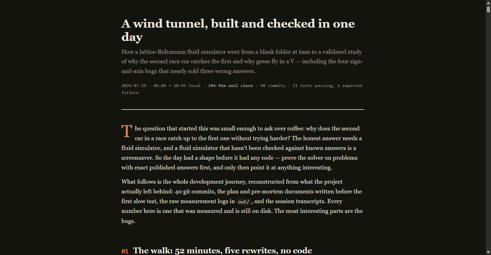

# LBM Wind Tunnel — the drafting effect

**Why does the second race car catch the first? Why do geese fly in a V?**
Both answered with a lattice-Boltzmann fluid simulator built from scratch and validated
against exact and published answers *before* it was allowed to show a single pretty
picture — then handed to you as a live wind tunnel that runs in your browser.

Built and checked in **14 hours 41 minutes** of wall clock, in one day.

---

## See it run

[](https://az9713.github.io/lbm-wind-tunnel/demo.html)

<sup>👆 Click the clip to play the full 95-second walkthrough.</sup>

Two cars running side by side, shedding vortices, with the drag gauges updating as the
flow evolves — all of it computed in the browser, in real time, by the same lattice-Boltzmann
algorithm the Python engine uses.

▶️ **[Full 95-second walkthrough](https://az9713.github.io/lbm-wind-tunnel/demo.html)** (1.7 MB) — every preset, the self-checks, and the paint-your-own-obstacle mode.
🎛️ **[Or just go and drive it yourself](https://az9713.github.io/lbm-wind-tunnel/site/).**  
🧪 **[New: Race + Theater MVP demo](https://az9713.github.io/lbm-wind-tunnel/mvp-demo.html)** — interactive, every knob exposed (gap₀, mass, ODE dt, golden tols, which acts to run, CSV export).

---

## Three things to open

| [**The wind tunnel**](https://az9713.github.io/lbm-wind-tunnel/site/) | [**MVP demo — Race + Theater**](https://az9713.github.io/lbm-wind-tunnel/mvp-demo.html) | [**The journey**](https://az9713.github.io/lbm-wind-tunnel/journey.html) |
|:--:|:--:|:--:|
| [](https://az9713.github.io/lbm-wind-tunnel/site/) | [](https://az9713.github.io/lbm-wind-tunnel/mvp-demo.html) | [](https://az9713.github.io/lbm-wind-tunnel/journey.html) |
| Full lab: drag cars, all presets, gallery, validation ledger. | Focused playground for the 2026-08-01 features: map-driven race ODE + three-act self-check theater, maximally configurable. Built by the **Grok** agent through **Buzz mobile**, in session with **Buzz Desktop** running at home; the **lbm-wind-tunnel** repo was cloned as a local Buzz project. | Build story: plan rewrites, axis bugs, 14h 41m, race/theater epilogue. |

All pages are self-contained — no server, no build step, no internet. Clone the repo
and open `site/index.html`, `mvp-demo.html`, or `journey.html` in Chrome.

---

## The physics

Nothing here is asserted beyond what was measured. Every number carries its context —
blockage ratio, voxel-counted frontal area, effective diameter, and mean ± std over whole
shedding cycles.

### The solver earns trust first

| Check | Measured | Reference |
|---|---|---|
| Equilibrium moments | exact to 1e-6 | algebraic identity |
| Taylor–Green decay | within 2% | analytic |
| Poiseuille profile | within 2% | analytic parabola |
| Wall drag = body force | 1e-4 | exact bookkeeping |
| Cylinder Re=20 drag | **2.437 ± 0.004** | 2.0–2.2 unbounded (13.75% blockage raises it) |
| Cylinder Re=100 Strouhal | **0.1925** | ≈0.164 unbounded; band 0.14–0.20 — *browser engine reads 0.1925 too* |
| Sphere Re=100 drag | **1.324** | Schiller–Naumann 1.09 ± 25% → 0.82–1.36 |
| Ising critical temperature | **0.91% off** | Onsager exact, 2.2692 |
| N-body energy drift | **0.001%** | 20k particles, 1500 steps |

### Why the second car catches the first

A car alone: **Cd 2.291**. Tucked a quarter-length behind another: **0.744** — a
**68% drag saving**, decaying to 53% at one length and 22% at three. The leader is
essentially unchanged. Side by side is the opposite trade: both cars read **2.913**,
27% *worse* than running alone, and they push each other apart.

Feed that measured map into the two cars' equations of motion — identical engines,
identical drivers — and the catch-up **emerges**: the trailing car closes from three
lengths to a quarter length in 34 time units, then holds station. Nobody scripted it;
less drag simply means more net thrust. The quasi-static assumption is reported with its
own falsifier next to it: **timescale ratio 11.4** (the gap closes ~11× slower than the
wake rearranges).

In full 3D with real geometry, two Ahmed bodies in tandem: leader **2.652**,
follower **1.619** — a **39% saving**.

### Why geese fly in a V

Built as a chain of gates, each of which had to pass before the next was allowed to run:

1. **Can we measure lift at all?** Wing at 6° angle of attack: Cl **1.081 ± 0.106**.
   Level: **0.125 ± 0.006**. An eight-fold difference, far above noise. ✅
2. **Is the mechanism there?** Behind the leader: **+0.00130** outboard of each wingtip,
   **−0.00158** between them. Air rising outside, sinking between — the counter-rotating
   tip-vortex pair, symmetric to three digits. ✅
3. **Does it help?**

| Bird | Cd | Cl | L/D | vs alone |
|---|---|---|---|---|
| flying alone | 2.7202 | 1.0663 | 0.3920 | — |
| leader | 2.7139 | 1.0651 | 0.3925 | +0.1% |
| trailing right | 2.7308 | 1.1134 | 0.4077 | **+4.0%** |
| trailing left | 2.7303 | 1.1149 | 0.4083 | **+4.2%** |

The trailing birds gain ~4% in lift-to-drag; the leader gains nothing — the exact
asymmetry formation-flight theory predicts, and the reason real geese rotate the lead.
Two checks sit inside that table: the two trailing birds are mirror images accounted
separately and agree to **0.15%**, and the gain comes from the *lift* column, not from
drag shelter — which is the physically correct route.

**Full suite: 21 passed, 1 xfailed in 17m 18s** (slow tests included). The xfail is
by design — at these Reynolds numbers a laminar wake genuinely persists past three car
lengths, so the recovery band from turbulent-flow literature doesn't apply. It's flagged,
not hidden.

---

## Where the 14h 41m went

Ranked by elapsed wall clock, measured from each piece's first artifact to its last.
Windows overlap (background jobs ran concurrently), so they don't sum to the total.

| # | Work | Elapsed | What ate the time |
|---|---|---|---|
| 1 | **Bird V-formation study** | **~7h 40m** | Run three times over — three axis/sign bugs each invalidated a completed run. The physics itself is ~90 min of it. |
| 2 | **3D gallery + hero pairs** | **~4h 40m** | Eight production runs at ~30 min each, plus video rendering. Pure background compute. |
| 3 | Interactive site | ~1h 30m | Two browser engines, UI, charts, accessibility pass. |
| 4 | 2D production runs | ~1h 10m | Cylinder Re=20 and Re=100 to convergence, plus the vortex-street video. |
| 5 | The planning walk | 52m | Five plan rewrites and a blind-spot survey. Zero code, highest leverage. |
| 6 | Drafting map + dynamics | ~40m | Seven-gap sweep, then the equations of motion. |
| 7 | 2D solver core | 37m | Lattice, streaming, collision, walls, forces — eight commits, each with its test. |
| 8 | Ising + N-body | 26m | Two extra validated simulations, start to finished video. |
| 9 | The 50× speedup | 23m | Fused numpy step + numba kernels. Paid for itself ten times over in rows 1–2. |
| 10 | Final test suite | 17m 18s | Exact, from the run log. |

The two biggest items are both **free background compute**. The single most expensive
line is **rework**. And the fastest block produced the most code — the whole validated
2D core in 37 minutes, because every piece had an exact answer to check against.

---

## What's here

| Piece | File(s) | Validation |
|---|---|---|
| D2Q9/D3Q19 BGK solver (numpy + optional numba, 20 MLUPS) | `lbm.py`, `lbm_fast.py` | Taylor–Green 2%, Poiseuille 2%, Couette, moment identities |
| Geometry: procedural + real-mesh voxelization (trimesh) | `geometry.py` | voxel volume vs mesh volume < 10% |
| Forces: exact half-way bounce-back momentum exchange | `diagnostics.py` | wall drag = body-force input to 1e-4 |
| Cylinder benchmarks | `run_cylinder2d.py` | Re=20 steady Cd in range; Re=100 St=0.1925 |
| Sphere drag | `tests/` (slow) | Schiller–Naumann Cd=1.09 ± 25% |
| **Two-car drafting study** | `run_drafting.py`, `dynamics.py` | trailing-car saving vs platoon literature; emergent catch-up |
| **Live race preset** (map-driven catch-up in the browser) | `site/race.js`, `site/app.js` | JS ODE within ~5% of Python `dynamicsMeta`; headless parity test |
| **Self-check theater** (§2 sequential show) | `site/selfcheck.js`, `site/app.js` | same three golden tols as individual cards; series plots |
| **MVP interactive demo page** | `mvp-demo.html` | configurable race + theater playground (README-linked) |
| **3-bird V-formation study** | `run_birds.py` | gated: lift resolvable → tip-vortex sign pattern → L/D benefit |
| 3D gallery: race car, Saturn V, airplane, ocean liner, bird | `run_shapes3d.py`, `assets/meshes/` | qualitative + Ahmed-body Cd reported vs 1984 experiment |
| Suite: Ising model, N-body galaxy merger | `ising.py`, `nbody.py` | Onsager Tc ± 3%; energy drift < 2% |
| **Interactive site** (live WebGL2 + CPU fallback) | `site/` | same three golden cases pass in-browser; St identical to Python |
| **Development journey** | `journey.html`, `docs/journey.src.html` | rebuild with `python tools/build_journey.py` |

## Running

```bash
pip install -r requirements.txt
pytest -m "not slow"          # fast physics suite (~30 s)
pytest                        # + slow validations (cylinder St, sphere, Ising, N-body)

python run_cylinder2d.py clip # 2D production run + vortex-street mp4
python run_drafting.py        # gap sweep -> out/drafting_map.csv
python dynamics.py            # emergent catch-up from the measured map
python run_shapes3d.py        # 3D gallery (background-friendly, ~30 min/object)
python run_birds.py all       # V-formation study (gated)
python ising.py               # Tc sweep + coarsening video
python nbody.py               # 20k-particle galaxy merger

python tools/render_gallery.py    # npz -> gallery mp4s
python tools/export_golden.py     # golden cases -> site
python tools/build_site_data.py   # results + media -> site
python tools/build_journey.py     # journey.src.html -> self-contained journey.html
node tools/test_js_engine.js full     # browser engine physics, headless (TG + Poiseuille + St)
node tools/test_dynamics_parity.js    # JS race ODE vs SITE_DATA.dynamicsMeta (~5%)
```

### Browser lab (after clone)

```bash
cd site && python -m http.server 8741   # then open http://localhost:8741
# Chrome caches app.js — hard-reload (Ctrl+Shift+R) after editing site JS
```

Presets include **Race — catch the leader** (Start/Pause/Reset; timescale ratio on the HUD).
§2 has **Run the show** for the three-act self-check theater.

## Honesty notes (also stated on the site)

- Real cars live at Re ~10⁷; these runs are Re ~10²–10³. Wakes, vortex streets,
  recirculation and drafting are genuine; the numbers are not engineering-grade
  aerodynamics and say so wherever they appear.
- The Ahmed body reads **Cd 2.62 at Re 131** against a published **0.30 at Re 4.3M**.
  That gap is the regime, not an error — it is *reported, not asserted*, and the only
  check applied is a wide laminar sanity band.
- Every force number carries its context: blockage ratio, voxel-counted frontal area,
  effective diameter (mask + half-link), mean ± std over the averaging window.
- The ship is fully immersed (wind-tunnel mode) — no free surface.
- The in-browser engine stores population deviations (f − w) to keep fp32 honest, and
  refuses to fake self-checks on fp16-only GPUs.
- The **Race** preset is map-driven (measured Cd(gap) + ODE), not full fluid–structure
  interaction; the timescale ratio on the HUD is the quasi-static validity check.
- Mesh credits and licenses: `assets/meshes/LICENSES.md`, `site/media/CREDITS.md`
  (CC-BY items must keep attribution wherever published).

## Docs

- [`journey.html`](journey.html) — the full development story, self-contained
- [`HANDOFF.md`](HANDOFF.md) — current state, how to resume, site gotchas
- [`docs/plans/2026-07-29-lbm-fluid-sim.md`](docs/plans/2026-07-29-lbm-fluid-sim.md) — original day-of-build spec + honesty protocol
- [`docs/plans/2026-08-01-live-drafting-selfcheck-theater.md`](docs/plans/2026-08-01-live-drafting-selfcheck-theater.md) — race + theater feature plan
- [`docs/plans/2026-08-01-MVP-IMPLEMENTATION-STATUS.md`](docs/plans/2026-08-01-MVP-IMPLEMENTATION-STATUS.md) — what shipped vs deferred (2026-08-01)
- [`docs/pre-mortem.md`](docs/pre-mortem.md) — per-validation-row bug-vs-physics table; four rows confirmed
- [`docs/2026-07-29-blindspot-pass.md`](docs/2026-07-29-blindspot-pass.md) — the unknown-unknowns survey that shaped the plan
